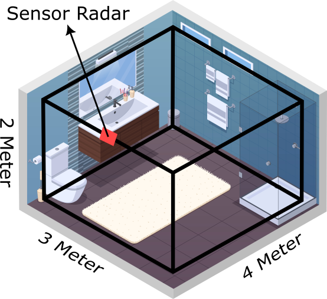

# 📡 Radar Toolbox 2D Tensor

A Python-based toolbox for processing, analyzing, and visualizing 2D tensor radar data. Useful for radar research, signal processing, and feature extraction workflows.

---

## 📁 Repository Structure

```
Radar-Toolbox-2DTensor/
├── main.py                # Entry point script for running the pipeline
├── all.ipynb              # Jupyter Notebook for EDA and visualization
├── andrikun_fixed.h5      # Radar dataset in HDF5 format
├── requirements.txt       # Python dependencies
├── ChirpConfigs/          # Radar chirp configuration files
├── common/                # Utility modules/functions
└── img/                   # Example images (evidence or result snapshots)
```

---

## ⚙️ Setup Instructions

1. **Clone the Repository**
```bash
git clone https://github.com/ndriuu/Radar-Toolbox-2DTensor.git
cd Radar-Toolbox-2DTensor
```

2. **Install Dependencies**
```bash
pip install -r requirements.txt
```

3. **Run the Notebook**
```bash
jupyter notebook all.ipynb
```

4. **Execute the Pipeline Script**
```bash
python main.py
```

> Ensure Python 3.7+ is installed and your environment supports HDF5 handling (via h5py).

---

## 🔬 Features

- Load and parse radar data from `.h5` format
- Apply signal processing algorithms to 2D radar tensors
- Visualize intermediate and final outputs
- Modular utility functions via `common/`
- Configurable chirp setups via `ChirpConfigs/`

---

## 🗺️ Mapping Explanation
<div style="background-color: white; padding: 10px; display: inline-block;">
  
</div>

_This section is reserved for describing how 2D radar tensors are mapped or transformed (e.g., Range-Doppler maps, heatmaps, occupancy grids)._ 

- Describe coordinate systems, projection methods, or custom mapping logic.
- Example: Mapping distance and velocity information into a 2D grid representation.

---

## 📊 Dataset Structure

- File: `andrikun_fixed.h5`
- Format: HDF5 with multidimensional radar frames
- Suggested description:
  - Shape: `(num_frames, height, width, channels)`
  - Each frame represents a 2D radar tensor (e.g., Range vs Doppler)

You can add a sample schema, statistics, or sample slices here.

---

## 🧠 Model Architecture (if applicable)

_Describe any models used for classification, detection, or regression tasks._

- Model type (e.g., CNN, LSTM, PointNet)
- Input shape and preprocessing
- Output interpretation (e.g., predicted class, score map)

---

## 📈 Results

_Add accuracy metrics, confusion matrix, or visualizations of predictions._

- Detection/classification performance (if any)
- Plots from `img/` that demonstrate success/failure
- Any evaluation on real vs simulated data

---

## 🚀 Use Cases

- Radar Signal Processing
- ML Preprocessing for Point Cloud / Tensor Radar Data
- Academic Research on Automotive / FMCW Radar
- Visualization of Radar Heatmaps or Doppler Grids

---

## 📚 References

- Python libraries: NumPy, Matplotlib, h5py
- Radar signal fundamentals (FMCW, Doppler processing)
- Jupyter Notebook for iterative analysis

---

## 📜 License

MIT License
