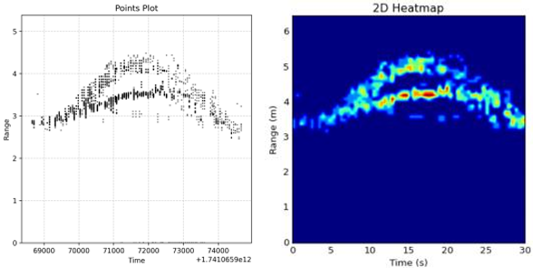
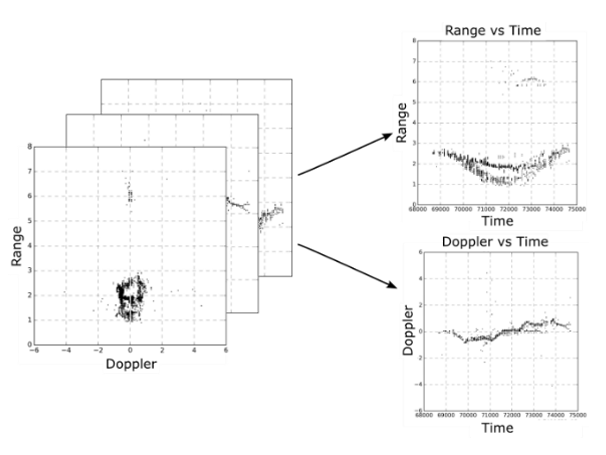
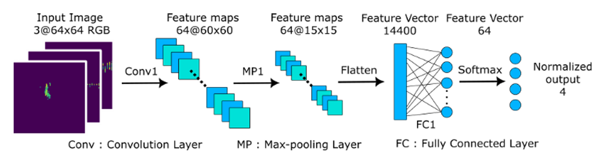
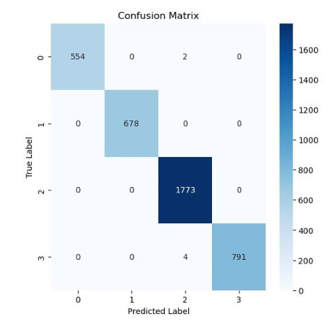
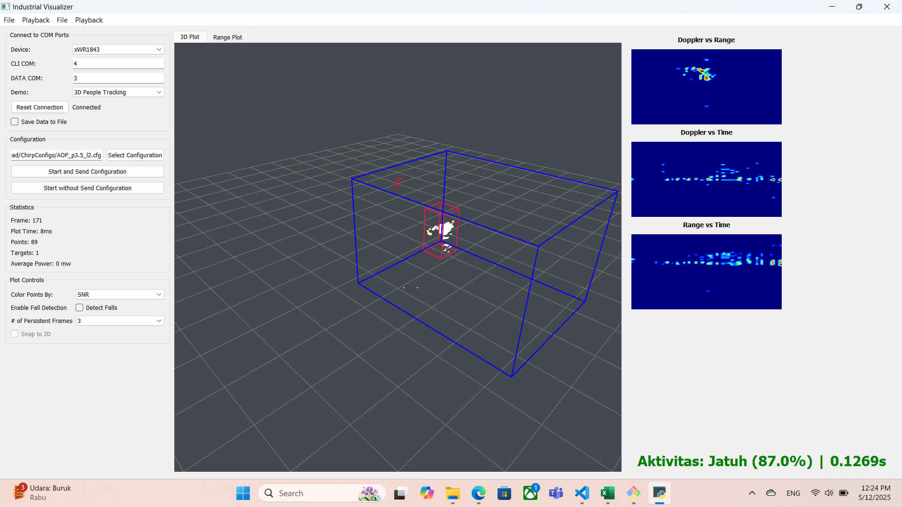

# 📡 Radar Toolbox 2D Tensor


A Python-based toolbox for processing, analyzing, and visualizing 2D tensor radar data. Useful for radar research, signal processing, and feature extraction workflows.

---

## 📁 Repository Structure

```
Radar-Toolbox-2DTensor/
├── main.py                # Entry point script for running the pipeline
├── all.ipynb              # Jupyter Notebook for EDA and visualization
├── andrikun_fixed.h5      # Radar dataset in HDF5 format
├── requirements.txt       # Python dependencies
├── ChirpConfigs/          # Radar chirp configuration files
├── common/                # Utility modules/functions
└── img/                   # Example images (evidence or result snapshots)
```

---

## ⚙️ Setup Instructions

1. **Clone the Repository**
```bash
git clone https://github.com/ndriuu/Radar-Toolbox-2DTensor.git
cd Radar-Toolbox-2DTensor
```

2. **Install Dependencies**
```bash
pip install -r requirements.txt
```

3. **Run the Notebook**
```bash
jupyter notebook all.ipynb
```

4. **Execute the Pipeline Script**
```bash
python main.py
```

> Ensure Python 3.7+ is installed and your environment supports HDF5 handling (via h5py).

---

## 🔬 Features

- Load and parse radar data from `.h5` format
- Apply signal processing algorithms to 2D radar tensors
- Visualize intermediate and final outputs
- Modular utility functions via `common/`
- Configurable chirp setups via `ChirpConfigs/`

---

## 🗺️ Mapping Explanation


This section describes how radar data is mapped into 2D tensor representations used for visualization and classification.

- The raw radar data includes spatial and temporal parameters such as range, Doppler, and timestamp.
- Each cell in the tensor holds an intensity or feature value corresponding to signal strength or reflection.
- A temporal stack of these 2D tensors (accumulated over timestamps) can be constructed to capture motion patterns and temporal features for learning tasks.
---

## 📊 Dataset Structure
- Data Content:
  - Each entry includes multiple radar-related features:
    - **x, y, z** spatial coordinates
    - **doppler** (velocity information)
    - **range** (distance from sensor)
    - **azimuth** and **elevation** angles
    - **timestamp** (time of capture for each frame)
  - From this data, the system primarily utilizes **doppler**, **range**, and **timestamp** features to generate 2D tensor images for classification.
  - This rich set of features enables detailed spatial-temporal representation of the scene.
---

## 🧠 Model Architecture (if applicable)


_The classification model used in this toolbox is a Convolutional Neural Network (CNN).

- **Model Type**: CNN
- **Input**: 2D radar tensor image (e.g., range-Doppler map) with dimensions standardized during preprocessing.
- **Preprocessing**: Normalization of pixel intensity values, resizing if needed, and optional noise filtering.
- **Output**: Predicted class label (e.g., "walking", "standing", "sitting") with confidence score.



The model has demonstrated excellent performance on the given dataset, achieving an accuracy of approximately **99%**, indicating high reliability in distinguishing human movement patterns from radar data.

---

## 📈 Results

_The output of this toolbox is in the form of 2D radar tensor images along with their associated classification results.

- Each processed radar frame is visualized as a 2D image (e.g., range-Doppler map).
- A trained model (if used) performs classification on each frame (e.g., walking, sitting, etc.).
- The visualization may include overlays or annotations to indicate predicted classes.
- Screenshots of these results are saved in the `img/` folder for documentation and verification.

---

## 🚀 Use Cases

- Radar Signal Processing
- DL Preprocessing for Point Cloud / Tensor Radar Data
- Academic Research on Automotive / FMCW Radar
- Visualization of Radar Heatmaps or Doppler Grids

---

## 📚 References

- Python libraries: NumPy, Matplotlib, h5py
- Radar signal fundamentals (FMCW, Doppler processing)
- Jupyter Notebook for iterative analysis

---

## 📜 License

MIT License
